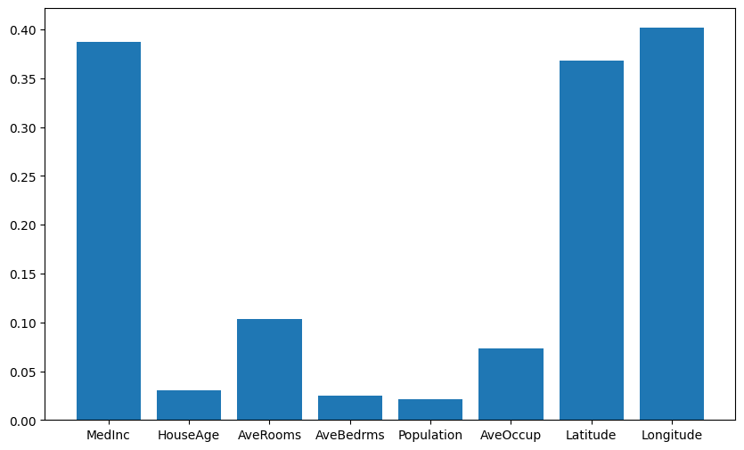
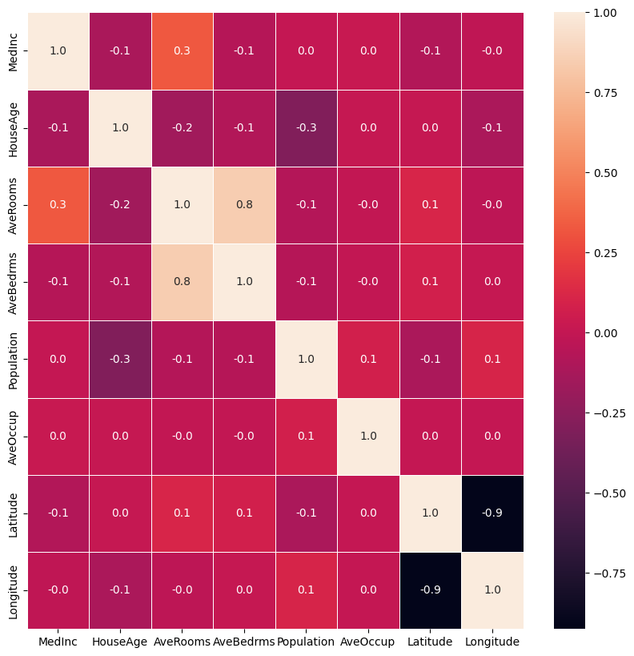
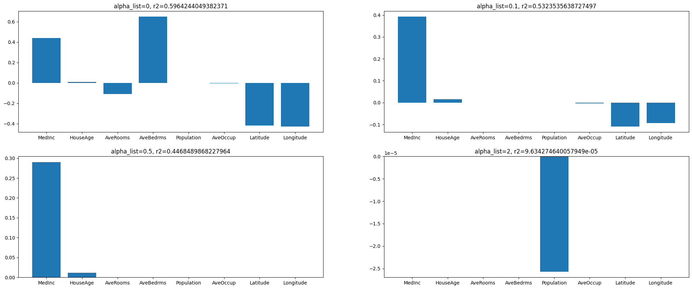

# Feature selection using different methods on California housing prices dataset


In this project, a concerted effort has been made to streamline the feature set through various methodologies, aiming to enhance the model's performance tailored to the specific dataset. The objective revolves around achieving the optimal R2 Score and Mean Squared Error, pivotal evaluation metrics for assessing model efficacy.

## Implementation Details

- Dataset: California Housing Dataset (view below for more details)
- Model: [Linear Regressor](https://scikit-learn.org/stable/modules/generated/sklearn.linear_model.LinearRegression.html)
- Input: 8 features - Median Houshold income, House Area, ...
- Output: House Price

## Dataset Details

This dataset was obtained from the StatLib repository ([Link](https://www.dcc.fc.up.pt/~ltorgo/Regression/cal_housing.html))

This dataset was derived from the 1990 U.S. census, using one row per census block group. A block group is the smallest geographical unit for which the U.S. Census Bureau publishes sample data (a block group typically has a population of 600 to 3,000 people).

A household is a group of people residing within a home. Since the average number of rooms and bedrooms in this dataset are provided per household, these columns may take surprisingly large values for block groups with few households and many empty houses, such as vacation resorts.

It can be downloaded/loaded using the sklearn.datasets.fetch_california_housing function.

- [California Housing Dataset in Sklearn Documentation](https://scikit-learn.org/stable/modules/generated/sklearn.datasets.fetch_california_housing.html)
- 20640 samples
- 8 Input Features: 
    - MedInc median income in block group
    - HouseAge median house age in block group
    - AveRooms average number of rooms per household
    - AveBedrms average number of bedrooms per household
    - Population block group population
    - AveOccup average number of household members
    - Latitude block group latitude
    - Longitude block group longitude
- Target: Median house value for California districts, expressed in hundreds of thousands of dollars ($100,000)

## Feature selection methods used 

- Supervised methods
    - Filter Based methods
        - mutual_info_regression
        - Pearson correlation (f_regression) (Input & output)
        - Pearson correlation (using pandas) (Input)
    - Wrapped based Methods
        - Recursive feature elimination [RFE]
        - Sequential feature selection
    - Embeded methods
        - Lasso
- unsupervised method
    - Principal component analysis [PCA] (Dimentionality reduction technique)


## Evaluation and Results


| Methods                                          | Metric(R2_score) | Metric(MSE) |
| ------------------------------------------------ | ----------------- | ------------ |
| Filter based - mutual information [selectKbest] | 0.588             | 0.541        |
| Filter based - mutual information [SelectPercentile] | 0.563             | 0.579        |
| Filter based - Pearson correlation [1]          | 0.523             | 0.653        |
| Filter based - Pearson correlation [2]          | 0.483             | 0.687        |
| Wrapped based Methods - [RFE]                   | 0.593             | 0.534        |
| Wrapped based Methods - Sequential feature selection | 0.513             | 0.644        |
| Embeded methods - Lasso- 0 alpha                | 0.622             | 0.530        |
| PCA                                              | 0.518             | 0.631        |


in above table it is clearly understood that Lasso method has given the most optimal results 

shown below are certain visualization gatherd from the project 

plotted feature_names to mutual_info_regression(x,y)

heatmap of correlation using seaborn

Plotted bar chart on feature_names to W (with 4 different alpha values)




## Key Takeaways

feature selection is amazing way to overcome overfitting issue and improve model efficacy

## How to Run

The code is built on Google Colab on an iPython Notebook. 

```bash
Simply download the repository, upload the notebook and dataset on colab, and hit play!
```


## Roadmap

What are the future modification you plan on making to this project?

- will Try more models

## Libraries 

**Language:** Python

**Packages:** Sklearn, Matplotlib, Pandas, Seaborn

## FAQ

#### Question 1 : why feature selection ?

Feature selection is a crucial step in the machine learning process aimed at enhancing accuracy and predictive power. By identifying and retaining the most impactful variables while discarding redundant or irrelevant ones, feature selection optimizes algorithm performance, thus bolstering the overall efficacy of predictive models. This underscores the significant importance of feature selection in machine learning workflows.
- Decreases over-fitting  
Fewer redundant data means fewer chances of making decisions based on noise.
- Improves Accuracy  
Less misleading data means better modeling accuracy.
- Reduces Training Time  
Less data means quicker algorithms.

#### Question 2 : which method gave the best output comparatively for this dataset

- Lasso


## Contact

If you have any feedback/are interested in collaborating, please reach out to me at [](https://www.linkedin.com/in/kartikey-vyas-2a29b9273) &nbsp; <a href="mailto:kvsvyas@gmail.com"> 


## License

[MIT](https://choosealicense.com/licenses/mit/)

